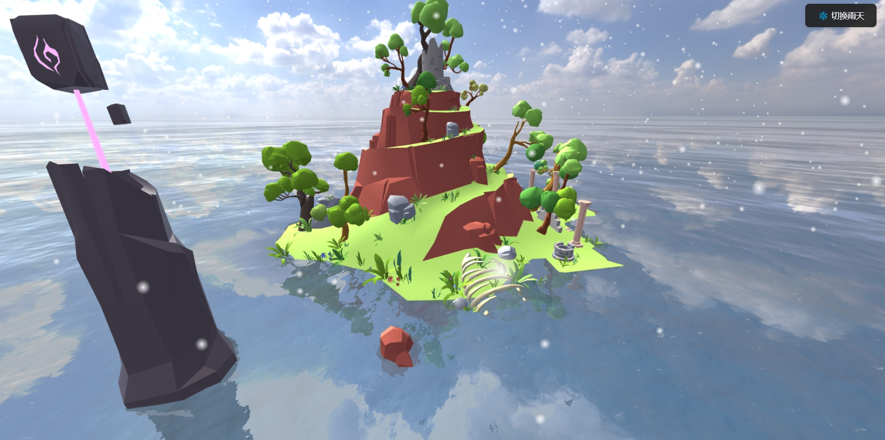

# 🏝️ Fantasy Island 3D Visualization 

[](https://vuejs.org/)
[](https://threejs.org/)

**沉浸式奇幻岛屿三维可视化系统**，集成动态天气系统、物理水面渲染与智能生态模拟。



## ✨ 核心特性
- 动态天气系统（雨/雪粒子切换）
- 基于物理的水面渲染（折射/反射效果）
- HDR环境光照（4K EXR天空盒）
- 交互式模型点击反馈（GSAP动画驱动）
- 智能飞鸟群体行为模拟

## 🚀 快速开始
### 开发环境
```bash
cd Fantasy-Island-3D-Visualization
npm install
npm run dev
```

### 构建生产版本
```bash
npm run build
```


## 🎮 交互控制
| 操作               | 功能                |
|--------------------|---------------------|
| 鼠标左键拖拽       | 旋转视角            |
| 鼠标右键拖拽       | 平移场景            |
| 鼠标滚轮           | 缩放视角            |
| 点击岛屿元素       | 触发缩放动画        |


## 🙏 致谢
- 岛屿模型基于 [https://sketchfab.com/search?q=island&type=models)
- 天空HDRI基于 [https://polyhaven.com/a/kloofendal_48d_partly_cloudy_puresky)
- 鸟群模型基于[https://sketchfab.com/search?q=bird&type=models)
